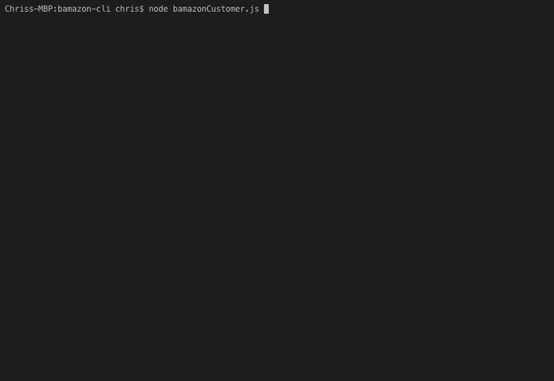

# Bamazon Storefront CLI

## Overview

The CLI app will take in orders from customers and deplete stock from the store's inventory. It can track product sales accross the store's departments and then provide a summary of the highest-grossing departments in the store. The app will also give a "manager" the ability to edit inventory by adding additonal products, additional inventory quantity, as well as view low inventory quantities.



## Installation

> Clone

```shell
$ git clone https://github.com/nguyenchris/bamazon-cli.git
```

> Install with npm

```shell
$ npm install
```

> Execute scheme.sql and seeds.sql into MySQLWorkbench or shell. Specify necessary values util/database.js

```js
host: *your-value*,
port: *your-value*,
user: *your-value*,
password: *your-value*,
database: *your-value*
```


### Commands

1. `node bamazonCustomer.js`

* Purchase a product by ID

2. `node bamazonManager.js`

* View Products for Sale
* View Low Inventory
* Add to Inventory
* Add New Product

3. `node bamazonSupervisor.js`

* View Product Sales by Department
* Create New Department


### Examples

1. `node bamazonCustomer.js`


2. `node bamazonManager.js`


3. `node bamazonSupervisor.js`


### Author
[Chris Nguyen](https://github.com/nguyenchris)


